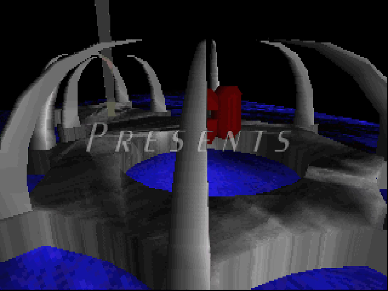
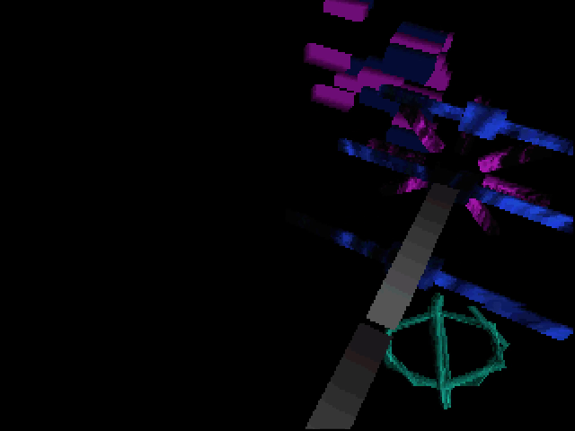
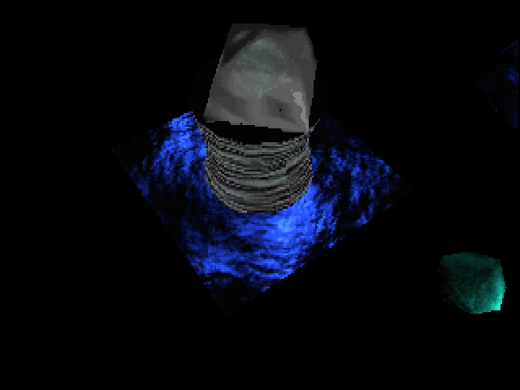
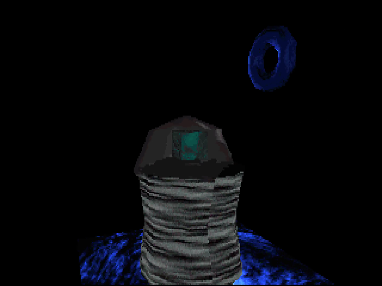
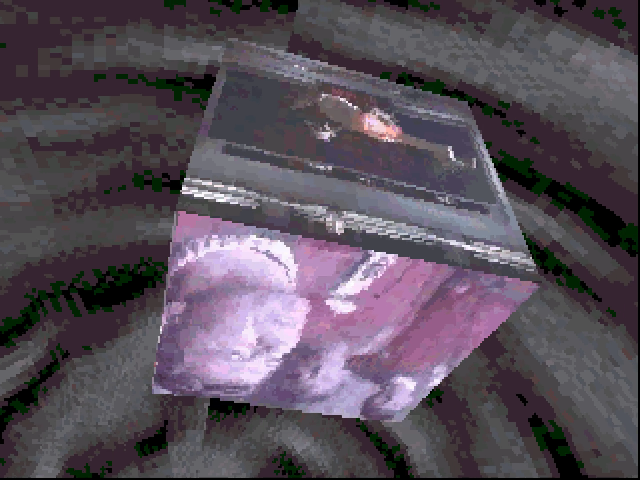
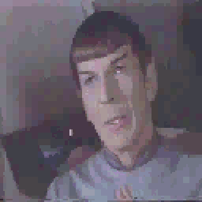

# The Search for Steve (TSFS)

[](#)
[-orange.svg)](#)
[](#)
[](#)

> **"The Search for Steve"** is a classic 1997 PC demoscene production created by **Chaotic Order** and presented at **The Gathering 1997 (TG97)** demoparty in Hamar, Norway (12th place in the PC Demo Competition).

---

## 📺 Full Demo Video (4m 39s)

https://github.com/user-attachments/assets/085ce18e-bc82-4995-a01c-ce338a1f5bb1

<div align="center">
  <sub>Full demo capture with synchronized 48kHz audio. High-definition 1080p download also available in <b><a href="https://github.com/HyperVon/tsfs/releases/tag/v1.0.0">Release v1.0.0</a></b>.</sub>
</div>

---

## 🎬 3D Scene Gallery

<div align="center">

| 3D Logo & Spikes | Waving Box Matrix | Multi-Axis 3D Toruses |
| :---: | :---: | :---: |
|  |  |  |

| The Search Journey | 3D Video Cube | Video Stream (Spock) |
| :---: | :---: | :---: |
|  |  |  |

</div>

---

## 🏛️ Origins & The 1990s Demoscene

### 🎓 Born in a CUNY Computer Lab & "The Bible"
*The Search for Steve* was crafted in 1996–1997 by undergraduate students at the **CUNY College of Staten Island (CSI)** in New York: coders **Hypersomnia** ([@HyperVon](https://github.com/HyperVon)) and **Sirmikey**, alongside fellow CSI student and musician **Planet B**.

Working late nights in the CSI computer lab between and after classes with no formal 3D graphics curriculum, commercial game engines, or GPU acceleration, they built their entire 3D pipeline from first principles. The group's official 1997 homepage was even hosted directly on a Sun Microsystems workstation sitting in the college lab:
```text
http://sunburn.cs.csi.cuny.edu/co.html
```
*(Though truth be told, we didn't use that Sun box for much else!)*

Their primary theoretical foundation came from the legendary 1,200-page white hardcover tome known universally throughout computer science as **"The Bible of Computer Graphics"** (*Computer Graphics: Principles and Practice* by Foley, van Dam, Feiner, & Hughes). 

Armed with "The Bible", the team manually translated foundational academic algorithms into high-performance, real-time MS-DOS C and x86 fixed-point assembly:
* **View-Frustum Polygon Clipping**: Translating **Sutherland-Hodgman clipping** equations into real-time 3D screen culling ([`src/diff2c.c`](src/diff2c.c))
* **Shading & Illumination**: Deriving **Lambertian Gouraud shading** cosine dot products and sub-pixel edge interpolation ([`src/gouraud.c`](src/gouraud.c))
* **3D Matrix Transformations**: Implementing 4×4 homogeneous coordinate transforms and perspective division in 16.16 fixed-point math ([`src/co3de.c`](src/co3de.c))
* **Spline Interpolation**: Adapting **Kochanek-Bartels / cubic Hermite curves** into an interactive camera path editor ([`src/spline_1.c`](src/spline_1.c), [`src/record.c`](src/record.c))

---

---

### 🛸 The Origin of the Title: *Why "The Search for Steve"?*
The title of the demo is a playful mashup of *Star Trek III: The Search for Spock* and **Steve**—who was **Planet B's brother** and also attended CUNY CSI with the team.

One afternoon while working in the college computer lab and brainstorming names for their upcoming demoparty entry, the group spent half the day trying to track Steve down around campus. In the middle of tossing around title ideas, someone joked: *"Why not call it 'The Search for Steve'?"*

It was funny, stupid, and completely ridiculous—which made it instantly unanimous. The name perfectly embodied the playful, irreverent spirit of **Chaotic Order**.

*(Despite the title, Steve himself never actually appears in the demo! The digitized 128×128 video clips and sound effects mapped onto the 3D video cube at the climax are direct rips from **Star Trek III: The Search for Spock**! Chaotic Order member **Erek** was on the ground in Hamar, Norway representing the group in person at TG97, and reported back over IRC that when the demo finished playing on the giant projection arena screens, bewildered demosceners in the crowd were turning to each other asking: **"Who the fuck is Steve?!"**)*

### 🌐 Connecting via IRC: The `#co` Channel & International Crew
While the core engine coders and Planet B were based in New York at CSI, the demoscene was a truly global subculture connected by **IRC (Internet Relay Chat)**.

Chaotic Order hung out in their own dedicated IRC channel, **`#co`**. It was on `#co` that the Staten Island crew connected with talented international tracker musicians from Scandinavia:
* **Mesonyx** — Joining from **Iceland** 🇮🇸
* **Erek** — Joining from **Sweden** 🇸🇪

Collaborating entirely over IRC, FTP, and BBS networks across oceans, they combined New York coding with Nordic tracker audio to compete on the international stage at **The Gathering 1997 (TG97)** in Hamar, Norway—placing 12th in the PC Demo Competition.

---

### 🕹️ What Was the Demoscene?
The **demoscene** is an international computer art subculture focused on producing *demos*—non-interactive, self-contained audiovisual programs that calculate and render complex 3D graphics, visual effects, and multichannel music in real-time. 

In the 1990s, demosceners competed fiercely at massive European "demoparties" (like *The Gathering*, held inside the Vikingskipet Olympic speed skating arena with thousands of attendees). Demos were judged on pure programming ingenuity, artistic direction, visual design, and musical composition—pushing commodity computer hardware far beyond what manufacturers ever intended.

---

### 💻 1997 vs. Today: A Feat of Pure Software Rendering
To modern eyes accustomed to real-time ray tracing and 4K displays, a 320×200 retro demo might seem simple—until you understand the severe hardware limitations of 1997:

| Metric | 1997 MS-DOS PC (Target Hardware) | Modern PC / Mac (Today) | Scale Difference |
| :--- | :--- | :--- | :--- |
| **GPU Acceleration** | **None** *(100% Pure Software Rendering on CPU)* | Dedicated GPU / Apple Silicon (e.g. RTX 4090 / M-Series) | **Infinite** *(No 3D hardware existed on target PCs)* |
| **CPU Clock & Architecture** | Single-Core Intel Pentium @ 100–166 MHz | 8–24 Cores @ 3.5–5.7 GHz | **>1,000× faster per core** |
| **Floating-Point Throughput** | ~0.15 GFLOPS | 15–80+ TFLOPS | **>100,000× higher compute capacity** |
| **System Memory (RAM)** | 16 MB – 32 MB | 16 GB – 64 GB | **~1,000× to 2,000× more memory** |
| **Display Mode** | 320×200 with 256 indexed palette colors (VGA Mode 13h) | 3840×2160 (4K) 32-bit True Color (16.7M colors + HDR) | **~130× pixel count**, unconstrained color depth |
| **Math Optimization** | 16.16 Fixed-Point Math & Precomputed 64KB LUTs | 64-bit IEEE Floating Point & SIMD Vector Instructions | Direct FP calculation in hardware |

#### ⚡ Why This Was an Engineering Achievement
* **Full 6DOF Arbitrary 3D Pipeline**: While much of the mid-1990s gaming world was still utilizing 2.5D raycasting (*Wolfenstein 3D*) or BSP sector rendering (*Doom*), this engine implemented full 6-degrees-of-freedom 3D geometry with 98 trueSpace Caligari meshes, 4×4 homogeneous coordinate matrices, Sutherland-Hodgman view-frustum clipping, and sub-pixel edge-walking software rasterizers written completely from scratch.
* **Live Video Texture-Mapped in Real Time**: In 1997, simply decompressing and playing back a 128×128 video stream consumed a massive fraction of a Pentium CPU's cycles. Texture-mapping that 266-frame video stream onto multiple rotating faces of a 3D polygonal cube simultaneously—while calculating matrix transformations, lighting, and camera paths in pure software—was a major technical feat.
* **In-Engine 3D Tooling & Splines**: Rather than hardcoding camera coordinates or settling for jerky cuts, the team built their own interactive in-engine 3D flight recorder ([`src/record.c`](src/record.c)) and implemented **Kochanek-Bartels (TCB) cubic Hermite splines** with ease-in/ease-out acceleration profiles—the exact mathematical curve interpolation used by commercial packages like 3D Studio and Lightwave.
* **Early Spatial 3D Audio on DOS**: Years before DirectSound3D, OpenAL, or Creative EAX became standard, the engine calculated real-time 3D distance vectors ($Z$-depth volume attenuation) and horizontal angular offsets to dynamically spatial-pan voice clips in stereo space alongside a 16-channel digital tracker music mixer.
* **16.16 Fixed-Point Arithmetic & 64KB LUTs**: Because floating-point division was prohibitively slow on early x86 CPUs, all 3D trigonometry and projection math was implemented using 32-bit fixed-point integers (16 bits integer, 16 bits fractional), while real-time alpha transparency, motion blur, and depth lighting used precomputed 16KB/64KB lookup tables (`*.LUT`) for single-cycle color blending.
* **Undergrads on the International Stage**: While commercial titans (id Software, Epic MegaGames) had multi-million dollar budgets and veteran teams, *The Search for Steve* was created by undergraduate college students translating academic algorithms from *Foley & van Dam* after hours in a CUNY lab, competing on the global demoscene stage at The Gathering 1997 in Norway.

---
## 👥 Credits (Chaotic Order)

From the original `Tsfs.nfo`:

* **Hypersomnia** ([@HyperVon](https://github.com/HyperVon)) — Code / GFX / Design
* **Sirmikey** — Code / GFX / Design
* **int** — Code
* **Planet B** — Music / GFX / Design
* **Mesonyx** — Music
* **Erek** — Music

### Special Thanks & Technology
* **Tran & Daredevil** — PMODE/W 1.33 DOS Extender
* **René Olsthoorn** — EXEDAT compression & archive system
* **MikMak** — Sound engine routines

---

## 🚀 How to Run

The demo runs with full audio and visual accuracy on modern systems via **DOSBox Staging** (recommended), **DOSBox-X**, or classic **DOSBox**.

### 🍎 macOS

1. Install **DOSBox Staging** via Homebrew:
   ```bash
   brew install dosbox-staging
   ```
2. Run the included launch script:
   ```bash
   ./run.sh
   # or:
   dosbox-staging --conf dosbox.conf
   ```

---

### 🪟 Windows 11 / 10

1. Install **DOSBox Staging** via Windows Terminal / PowerShell:
   ```powershell
   winget install DOSBox-Staging.DOSBox-Staging
   ```
   *(Or download from [dosbox-staging.github.io](https://dosbox-staging.github.io/))*
2. Double-click **`run-windows.bat`**.

---

### 🐧 Linux (Ubuntu, Debian, Fedora, Arch)

1. Install **DOSBox Staging**:
   * **Ubuntu / Debian**: `sudo apt install dosbox-staging` (or `dosbox`)
   * **Fedora**: `sudo dnf install dosbox-staging`
   * **Arch Linux**: `sudo pacman -S dosbox-staging`
   * **Flatpak**: `flatpak install flathub io.github.dosbox_staging`
2. Run the launch script:
   ```bash
   ./run.sh
   ```

---

## 🎥 Video & Audio Recording Hotkeys

To record high-quality video or audio directly from **DOSBox Staging**:

| Action | macOS | Windows / Linux |
| :--- | :--- | :--- |
| **Start / Stop Video Recording** | `Cmd + F7` *(or `Fn + Cmd + F7`)* | `Ctrl + Alt + F5` *(or `Ctrl + F7`)* |
| **Start / Stop Audio Recording** | `Cmd + F6` *(or `Fn + Cmd + F6`)* | `Ctrl + F6` |
| **Take Screenshot** | `Cmd + F5` *(or `Fn + Cmd + F5`)* | `Ctrl + F5` |
| **Toggle Fullscreen** | `Option + Return` | `Alt + Enter` |

*All captured videos, audio, and screenshots are saved in the `capture/` directory.*

---

## 📁 Repository Structure

* **[`assets/`](assets/)** — Original demo assets organized by category:
  * [`models/`](assets/models/) — 98 Caligari trueSpace 3D meshes (`*.COB`)
  * [`paths/`](assets/paths/) — 6 keyframed 3D camera path streams (`*.PTH`)
  * [`worlds/`](assets/worlds/) — 5 scene graph definitions (`*.WLD`)
  * [`luts/`](assets/luts/) — 17 software rendering lookup tables (`*.LUT`)
  * [`audio/`](assets/audio/) — FastTracker II modules (`*.XM`) and voice clips (`*.WAV`)
  * [`palettes/`](assets/palettes/) — 256-color VGA palette (`PALETTE.RAW`)
  * [`data/`](assets/data/) — Original compressed asset archive (`TSFS.DAT`)
* **[`src/`](src/)** — Complete original C source code and Chaotic Order 3D Engine.
* **[`extracted/`](extracted/)** — Unpacked assets from `TSFS.DAT` (`video_frames/`, `textures/`, `screens/`).
* **[`docs/`](docs/)** — Screenshots, previews, and 1080p full demo recordings.
* **[`tools/`](tools/)** — Extraction and capture conversion utilities.

---

## 📂 Original Source Code (`src/`)

The original C source code and 3D engine from 1997 are preserved in the [`src/`](src/) directory:

* **Demo Sequencer & Scenes**:
  * [`tsfs.c`](src/tsfs.c) — Main demo orchestration and timeline
  * [`cointro.c`](src/cointro.c) — Chaotic Order 3D intro sequence
  * [`scene1.c`](src/scene1.c), [`scene2.c`](src/scene2.c), [`scene3.c`](src/scene3.c) — Individual 3D scenes
* **Chaotic Order 3D Engine Core**:
  * [`co3de.c`](src/co3de.c) / [`co3de.h`](src/co3de.h) — 3D engine core, matrix math, lighting, clipping, and Caligari trueSpace `.COB` parser
  * [`diff2c.c`](src/diff2c.c) — Inner-loop software polygon rasterizer (flat, Gouraud, texture-mapped, transparent, environment-mapped)
  * [`spline_1.c`](src/spline_1.c) / [`spline_2.c`](src/spline_2.c) — 3D spline camera & object path interpolation
  * [`tmapflat.c`](src/tmapflat.c), [`tmapgour.c`](src/tmapgour.c), [`texture.c`](src/texture.c) — Texture-mapping routines
  * [`gouraud.c`](src/gouraud.c), [`flat.c`](src/flat.c) — Shading and lighting pipelines
* **Visual Effects & Support**:
  * [`fire.c`](src/fire.c), [`fire256.c`](src/fire256.c), [`anti.c`](src/anti.c) — Fire and antialiasing/blur post-processing
  * [`pcx.c`](src/pcx.c) / [`pcx.h`](src/pcx.h) — PCX image loader
  * [`cotypes.h`](src/cotypes.h), [`fixed32.h`](src/fixed32.h), [`constant.c`](src/constant.c) — 16.16 fixed-point math and lookup tables
  * [`mikmod.h`](src/mikmod.h) — Sound system headers

---

### 🎥 The Interactive Camera Path Recorder & Spline Engine

In 1997, Chaotic Order built a custom in-engine 3D camera path creation workflow to choreograph cinematic scene transitions:

1. **Interactive 3D Waypoint Recorder ([`src/record.c`](src/record.c) & [`src/record1.c`](src/record1.c))**:
   * Allowed the designer to fly through any 3D scene in real-time using keyboard controls:
     * **Camera Viewpoint**: Numpad `4`/`6` (X), `8`/`2` (Y), `+`/`-` (Z in 16.16 fixed-point).
     * **Camera Look-At Target**: `A`/`S` (X), `W`/`Z` (Y), `[`/`]` (Z).
     * **Directional Light Angle**: `7`/`9`, `1`/`3`.
   * Pressing **`R`** captured the current viewpoint, look-at target, and light vector, appending a 36-byte keyframe record to the `*.PTH` stream.
2. **Kochanek-Bartels Spline Interpolation ([`src/spline_1.c`](src/spline_1.c) & [`src/spline_2.c`](src/spline_2.c))**:
   * Evaluates cubic Hermite curves across control points with customizable **Tension**, **Continuity**, and **Bias** (TCB splines based on SIGGRAPH '84 research).
   * Incorporates ease-in and ease-out acceleration profiles (`Ease(float t, float a, float b)`) so camera movements accelerate and decelerate smoothly around corners.
3. **Trajectory Previewer ([`src/play.c`](src/play.c), [`src/play2.c`](src/play2.c), [`src/play3.c`](src/play3.c))**:
   * Tested and visualized the interpolated camera paths in real-time within DOS before integrating into the final demo sequencer ([`src/tsfs.c`](src/tsfs.c)).

---

## ⚙️ Technical Architecture & Reverse Engineering

| Component | Format / Engine | Details |
| :--- | :--- | :--- |
| **DOS Extender** | PMODE/W 1.33 | 32-bit flat protected mode for high-performance x86 rasterization |
| **3D Geometry** | Caligari trueSpace (`*.COB`) | 98 binary meshes (`PolH` chunks with vertices, UV texture coordinates, and polygon face tables) |
| **Scene Graph** | Custom (`*.WLD`) | Defines object composition, background texture atlases, shading modes, and color tinting |
| **Camera Paths** | Custom (`*.PTH`) | Keyframed 3D camera trajectory streams (36 bytes per waypoint: translation and BAM rotation angles) |
| **Asset Archive** | EXEDAT (`TSFS.DAT`) | 271 packaged resources compressed with Okumura's **LZARI** arithmetic coding algorithm |
| **Video Playback** | Raw Paletted Frames (`clip000.raw` – `clip265.raw`) | 266 frames (128×128 8-bit) texture-mapped in real-time onto 3D planes |
| **Look-Up Tables** | 17 LUTs (`*.LUT`) | Precalculated 64KB & 16KB tables for real-time 8-bit motion blur, Gouraud/depth shading, and cross-fading |
| **Music & Sound** | FastTracker II (`*.XM`) & WAV | `INTRO1.XM` & `IDEA5.XM` multichannel tracker modules with synchronized 8-bit voice clips |


---

## 🎵 The Soundtrack & The Art of Tracker Music

The demo features multi-channel digital tracker soundtracks stored in **FastTracker II Extended Module (`*.XM`)** format:

* **[`assets/audio/INTRO1.XM`](assets/audio/INTRO1.XM)** — Composed by **Planet B** (Intro sequence)
* **[`assets/audio/IDEA5.XM`](assets/audio/IDEA5.XM)** — Composed by **Planet B**, **Mesonyx** (Iceland), and **Erek** (Sweden) (Main demo journey)

### 🎹 What Was a "Tracker"?
In the 1990s demoscene, tracker music was an extraordinary marriage of musical composition and computer hacking:

* **Why Not MP3 or WAV?** In 1997, streaming raw digital audio (WAV/MP3) was impossible—a single 4-minute uncompressed song was 45+ MB (far exceeding the entire RAM of a PC and too large for floppy disks or 33.6k dial-up downloads), while decoding early MP3s consumed 100% of a Pentium CPU just for playback.
* **Why Not MIDI?** Standard MIDI files contained only note instructions, relying on whatever cheap FM synthesizer was built into the user's sound card, sounding completely different (and often terrible) on every machine.
* **The Tracker Solution**: Trackers like **FastTracker II** solved this by bundling **real digital instrument sound samples** (drums, bass, synths, voice clips) inside the file itself, alongside a vertical "spreadsheet" of step-sequenced patterns.
* **Coding Music in Hex**: Tracker musicians didn't compose on musical sheet staves—they entered alphanumeric hex codes into multi-column matrices, programming pitch shifts, portamento slides, volume envelopes, and arpeggios per-tick in real time. The demo engine (via MikMak's MikMod driver) mixed these audio channels in software on the fly with crystal-clear output on Sound Blaster 16 and Gravis UltraSound cards.


### 🔊 Positional 3D Audio & Sound Effects
Alongside the background `.XM` music, the demo loaded standalone digitized voice and sound clips ([`assets/audio/CLIP1.WAV`](assets/audio/CLIP1.WAV) through [`CLIP6.WAV`](assets/audio/CLIP6.WAV)) into extra sound effect channels in MikMod:
* **Distance Attenuation**: Modulated sound volume dynamically via `Voice_SetVolume()` based on the camera's 3D distance ($Z$-depth proximity) to the sound source in the scene.
* **Stereo 3D Panning**: Calculated spatial stereo placement via `Voice_SetPanning()` (0 = full left, 128 = center, 255 = full right) based on the horizontal orientation and angle between the camera viewpoint and what was facing the viewer—creating an early attempt at real-time 3D spatialized audio on MS-DOS!

---

### 🛠️ Asset Extraction Tool

To extract all 271 original assets from `TSFS.DAT`:
```bash
clang -O2 tools/extract_tsfs.c -o tools/extract_tsfs
./tools/extract_tsfs
```
This unpacks all assets cleanly into `extracted/video_frames/`, `extracted/textures/`, and `extracted/screens/`.

---

## 🌐 Historical Links

* **Pouët.net Entry**: [The Search for Steve on Pouët](https://www.pouet.net/prod.php?which=8627)
* **Demozoo Entry**: [The Search for Steve on Demozoo](https://demozoo.org/productions/18973/)
* **Scene.org Archive**: [The Search for Steve on Scene.org](https://files.scene.org/view/parties/1997/thegathering97/demo/tsfs.zip)
* **The Gathering**: [The Gathering 1997 (TG97)](https://www.gathering.org/)
* **Original NFO**: View [Tsfs.nfo](Tsfs.nfo)

---

<div align="center">
  <sub>Preserved & modernized for historical demoscene archival by Hypersomnia ([@HyperVon](https://github.com/HyperVon)) / Chaotic Order.</sub>
</div>
