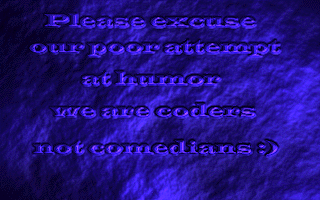
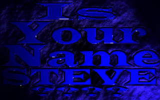

# The Search for Steve (TSFS)

[](#)
[-orange.svg)](#)
[](#)
[](#)

> **"The Search for Steve"** is a classic 1997 PC demoscene production created by **Chaotic Order** and presented at the **The Gathering 1997 (TG97)** demoparty in Hamar, Norway (12th place in the PC Demo Competition).

---

## 🎬 Previews & Screenshots

<div align="center">

| Intro Screen | The Video Cube (Steve Footage) | Ending Screen |
| :---: | :---: | :---: |
|  |  |  |

</div>

---

## 👥 Credits (Chaotic Order)

From the original `Tsfs.nfo`:

* **Hypersomnia** — Code / GFX / Design
* **Sirmikey** — Code / GFX / Design
* **int** — Code
* **Planet B** — Music / GFX / Design
* **Mesonyx** — Music
* **Erek** — Music

### Special Thanks & Technology
* **Tran & Daredevil** — PMODE/W 1.33 DOS Extender
* **René Olsthoorn** — EXEDAT compression & archive system
* **MikMak** — Sound engine routines

---

## 🚀 How to Run

The demo runs with full audio and visual accuracy on modern systems via **DOSBox Staging** (recommended), **DOSBox-X**, or classic **DOSBox**. Pre-configured launchers are included in this repository.

### 🍎 macOS

1. Install **DOSBox Staging** via Homebrew:
   ```bash
   brew install dosbox-staging
   ```
2. Run the included launch script (or launch via config directly):
   ```bash
   ./run.sh
   # or:
   dosbox-staging -conf dosbox.conf
   ```

---

### 🪟 Windows 11 / Windows 10

1. Install **DOSBox Staging** using `winget` in Windows Terminal / PowerShell:
   ```powershell
   winget install DOSBox-Staging.DOSBox-Staging
   ```
   *(Or download the installer from [dosbox-staging.github.io](https://dosbox-staging.github.io/))*
2. Double-click **`run-windows.bat`** (or open PowerShell in this folder and run `dosbox-staging -conf dosbox.conf`).

---

### 🐧 Linux (Ubuntu, Debian, Fedora, Arch)

1. Install **DOSBox Staging**:
   * **Ubuntu / Debian**: `sudo apt install dosbox-staging` (or `dosbox`)
   * **Fedora**: `sudo dnf install dosbox-staging`
   * **Arch Linux**: `sudo pacman -S dosbox-staging`
   * **Flatpak**: `flatpak install flathub io.github.dosbox_staging`
2. Run the launch script:
   ```bash
   ./run.sh
   ```

---

## 🎥 Recording Video from DOSBox

To record high-quality video with full synchronized audio directly from DOSBox Staging:

1. Launch the demo using `./run.sh` or `run-windows.bat`.
2. Press **`Ctrl + Alt + F5`** (or **`Ctrl + Option + F5`** on macOS) to start recording.
3. When the demo finishes, press **`Ctrl + Alt + F5`** again to stop.
4. The recorded video file will be saved in the `capture/` directory.

---


## 📂 Original Source Code (`src/`)

The original C source code and 3D engine from 1997 have been preserved in the [`src/`](src/) directory:

* **Demo Sequencer & Scenes**:
  * [`tsfs.c`](src/tsfs.c) — Main demo orchestration and timeline
  * [`cointro.c`](src/cointro.c) — Chaotic Order 3D intro sequence
  * [`scene1.c`](src/scene1.c), [`scene2.c`](src/scene2.c), [`scene3.c`](src/scene3.c) — Individual 3D scenes
* **Chaotic Order 3D Engine Core**:
  * [`co3de.c`](src/co3de.c) / [`co3de.h`](src/co3de.h) — 3D engine core, matrix math, lighting, clipping, and Caligari trueSpace `.COB` parser
  * [`diff2c.c`](src/diff2c.c) — Inner-loop software polygon rasterizer (flat, gouraud, texture-mapped, transparent, environment-mapped)
  * [`spline_1.c`](src/spline_1.c) / [`spline_2.c`](src/spline_2.c) — 3D spline camera & object path interpolation
  * [`tmapflat.c`](src/tmapflat.c), [`tmapgour.c`](src/tmapgour.c), [`texture.c`](src/texture.c) — Texture-mapping routines
  * [`gouraud.c`](src/gouraud.c), [`flat.c`](src/flat.c) — Shading and lighting pipelines
* **Visual Effects & Support**:
  * [`fire.c`](src/fire.c), [`fire256.c`](src/fire256.c), [`anti.c`](src/anti.c) — Special fire and antialiasing/blur post-processing
  * [`pcx.c`](src/pcx.c) / [`pcx.h`](src/pcx.h) — PCX image loader
  * [`cotypes.h`](src/cotypes.h), [`fixed32.h`](src/fixed32.h), [`constant.c`](src/constant.c) — 16.16 fixed-point math and lookup tables
  * [`mikmod.h`](src/mikmod.h) — Sound system headers

---
## ⚙️ Technical Architecture & Reverse Engineering

The codebase reflects the state-of-the-art in 1997 PC DOS demoscene programming:

| Component | Format / Engine | Details |
| :--- | :--- | :--- |
| **DOS Extender** | PMODE/W 1.33 | 32-bit flat protected mode for high-performance x86 rasterization |
| **3D Geometry** | Caligari trueSpace (`*.COB`) | 98 binary meshes (`PolH` chunks with vertices, UV texture coordinates, and polygon face tables) |
| **Scene Graph** | Custom (`*.WLD`) | Defines object composition, background texture atlases, shading modes, and color tinting |
| **Camera Paths** | Custom (`*.PTH`) | Keyframed 3D camera trajectory streams (36 bytes per waypoint: translation and BAM rotation angles) |
| **Asset Archive** | EXEDAT (`TSFS.DAT`) | 271 packaged resources compressed with Okumura's **LZARI** arithmetic coding algorithm |
| **Video Playback** | Raw Paletted Frames (`clip000.raw` – `clip265.raw`) | 266 frames (128×128 8-bit) texture-mapped in real-time onto 3D planes |
| **Look-Up Tables** | 17 LUTs (`*.LUT`) | Precalculated 64KB & 16KB tables for real-time 8-bit motion blur, gouraud/depth shading, and cross-fading |
| **Music & Sound** | FastTracker II (`*.XM`) & WAV | `INTRO1.XM` & `IDEA5.XM` multichannel tracker modules with synchronized 8-bit voice clips |

### 🛠️ Asset Extraction Tool

To extract all 271 original assets from `TSFS.DAT`:
```bash
clang -O2 tools/extract_tsfs.c -o tools/extract_tsfs
./tools/extract_tsfs
```
This extracts all 266 video frames, texture atlases (`cointro4.pcx`, `scene1.pcx`, `scene3.pcx`), and screen graphics (`comedy.pcx`, `steve.pcx`) into the `extracted/` folder.

---

## 🌐 Historical Links

* **Pouët.net Entry**: [The Search for Steve on Pouët](https://www.pouet.net/prod.php?which=8627)
* **Demozoo Entry**: [The Search for Steve on Demozoo](https://demozoo.org/productions/18973/)
* **Scene.org Archive**: [The Search for Steve on Scene.org](https://files.scene.org/view/parties/1997/thegathering97/demo/tsfs.zip)
* **The Gathering**: [The Gathering 1997 (TG97)](https://www.gathering.org/)
* **Original NFO**: View [Tsfs.nfo](Tsfs.nfo)

---

<div align="center">
  <sub>Preserved & modernized for historical demoscene archival by Chaotic Order.</sub>
</div>
